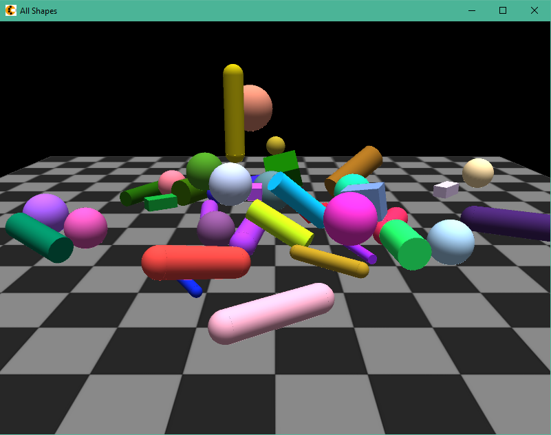

# Node.js 3D Bullet

This is a part of [Node3D](https://github.com/node-3d) project.

> npm i -s 3d-bullet-raub

## Synopsis

Bullet physics plugin for Node.js 3D Core

> Note: compilation tools must be in place on your system.
For Windows, use **ADMIN PRIVELEGED** command line:
\`npm i -g windows-build-tools\`.
Also **Windows** needs **vcredist 2013** to be installed.
