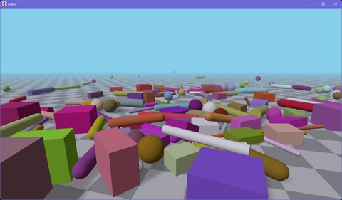

# Node.js 3D Bullet

This is a part of [Node3D](https://github.com/node-3d) project.

[](https://www.npmjs.com/package/3d-bullet-raub)

[](https://travis-ci.com/node-3d/3d-bullet-raub)
[](https://www.codefactor.io/repository/github/node-3d/3d-bullet-raub)

> npm i -s 3d-bullet-raub


## Synopsis

Bullet physics plugin for Node.js 3D Core



> Note: compilation tools must be in place on your system.
For Windows, use **ADMIN PRIVELEGED** command line:
\`npm i -g windows-build-tools\`.
Also **Windows** needs **vcredist 2013** to be installed.


## Usage

As any Node3D plugin, `3d-bullet-raub` exports a single function. Given a Node3D
object this function extends with `bullet` property. Now this property holds
whatever this plugin offers.

```
const core3d = require('3d-core-raub');
const bullet3d = require('3d-bullet-raub');

bullet3d(core3d);

const { three, bullet, Image, doc } = core3d;
const { Box, Sphere, Cylinder, Capsule } = bullet;

// ...
```

See examples for quick start.


## Exports

See docs of [bullet-raub](https://github.com/node-3d/bullet-raub). This plugin
reexports those as is.

Additionally there are few classes specific for this plugin:
* Shape - the base class to connect physical and visual entities.
* Box - 'box' shape.
* Cylinder - 'roll' shape.
* Sphere - 'ball' shape.
* Capsule - 'caps' shape.
