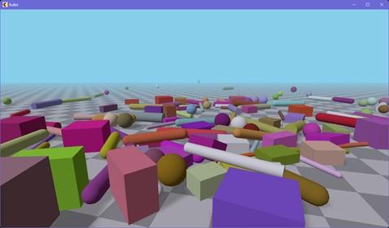

# Node3D Bullet Extension

This is a part of [Node3D](https://github.com/node-3d) project.

[](https://badge.fury.io/js/@node-3d%2Fplugin-bullet)
[](https://github.com/node-3d/plugin-bullet/actions/workflows/lint.yml)
[](https://github.com/node-3d/plugin-bullet/actions/workflows/test.yml)

```bash
npm install @node-3d/core @node-3d/plugin-bullet three
```

`@node-3d/plugin-bullet` connects the rigid-body simulation in `@node-3d/bullet`
to a Three.js scene managed by `@node-3d/core`. Use it when bodies should move
Three.js objects or when you want simple visible physics debug shapes.



The plugin creates one default Bullet `scene` and provides a `Shape` class. A `Shape` is a
regular Bullet `Body` with optional Three.js integration:

- Give it `mesh` to keep an existing `THREE.Object3D` synchronized with physics.
- Give it `sceneThree` and `debug` to create a generated solid or wireframe debug mesh.
- It still supports Bullet body options such as `type`, `size`, `mass`, `pos`, and velocities.

## Quick start

Create a static ground shape and a dynamic box, step the Bullet scene each frame, then draw
the Core screen. `scene` below is the Bullet scene; `screen.scene` is the Three.js scene.

```ts
import * as three from 'three';
import { Screen, addThreeHelpers, init } from '@node-3d/core';
import { init as initBullet } from '@node-3d/plugin-bullet';

const { loop } = init();
addThreeHelpers(three);

const screen = new Screen({ three });
const { scene, Shape } = initBullet({ three });

// A zero-mass body is static. The generated wireframe is added to screen.scene.
new Shape({
	sceneThree: screen.scene,
	type: 'plane',
	debug: 'wire',
	color: 0x4f81bd,
});

// A positive mass makes the box fall under the scene's default gravity.
const box = new Shape({
	sceneThree: screen.scene,
	pos: [0, 10, 0],
	mass: 3,
	debug: 'solid',
	color: 0xffb347,
	size: [3, 2, 1],
});

loop(() => {
	scene.update(); // advances Bullet and updates every active Shape
	screen.draw();
});
```

Use an explicit delta for deterministic/fixed-step simulation:

```ts
scene.update(1 / 60);
```

## API

### `init({ three? })`

Initializes the plugin once and returns a cached object. Pass the same `three` module used by
your Core screen if you want `Shape` to create debug geometry.

| Value | Purpose |
| --- | --- |
| `bullet` | The complete low-level `@node-3d/bullet` module for advanced use, including `Joint`. |
| `scene` | The default Bullet physics scene. Set `scene.gravity`, call `scene.update()`, or use `scene.hit()` / `scene.trace()`. |
| `Shape` | A `Body` subclass that can synchronize an object or generate a Three.js debug mesh. |

Calling `init()` again returns the first result. Initialize it before creating shapes; later
calls cannot replace its `three` module or default Bullet scene.

### `new Shape(options)`

`Shape` accepts the normal `@node-3d/bullet` body properties plus the following plugin options:

| Option | Meaning |
| --- | --- |
| `sceneBullet` | Use this Bullet scene instead of the plugin's default `scene`. |
| `sceneThree` | Three.js scene that receives a generated debug mesh. Required with `debug`. |
| `mesh` | Existing `THREE.Object3D` to synchronize with the body transform. |
| `debug` | `'solid'` or `'wire'` to create a generated debug mesh; omit it for no generated mesh. |
| `color` | Three.js color for the generated debug mesh. |

The ordinary Bullet body options are the physics controls you will use most often:

- `type`: `'box'` (default), `'ball'`, `'roll'`, `'pill'`, or `'plane'`.
- `size`, `pos`, `quat`, and `rot`: shape dimensions and transform. Vectors accept either
  arrays such as `[1, 2, 3]` or objects such as `{ x: 1, y: 2, z: 3 }`.
- `mass`: `0` for static bodies; a positive value for dynamic bodies.
- `vell` and `vela`: linear and angular velocity.
- `frict`, `rest`, `dampl`, `dampa`, and `sleepy`: contact, damping, and sleep settings.

When Bullet emits a body `update` during `scene.update()`, the plugin copies its position and
quaternion to `mesh` and to the generated debug mesh. Changing `type` or `size` rebuilds the
generated debug geometry. Calling `destroy()` releases the Bullet body and hides/removes a
supplied `mesh` from `sceneThree`.

### Attach your own mesh

Use `mesh` when the visual should be a real Three.js model rather than the plugin's simple
debug geometry. The plugin only owns transform synchronization; you retain ownership of model
materials, geometry, and any additional scene behavior.

```ts
const mesh = new three.Mesh(
	new three.BoxGeometry(3, 2, 1),
	new three.MeshStandardMaterial({ color: 0xffb347 }),
);
screen.scene.add(mesh);

const crate = new Shape({
	mesh,
	pos: [0, 10, 0],
	mass: 3,
	size: [3, 2, 1],
});

crate.on('update', ({ pos, quat }) => {
	// Physics has advanced; mesh has already received this transform.
	console.log(pos, quat);
});
```

For a larger interactive scene, see [examples/main.ts](examples/main.ts).
